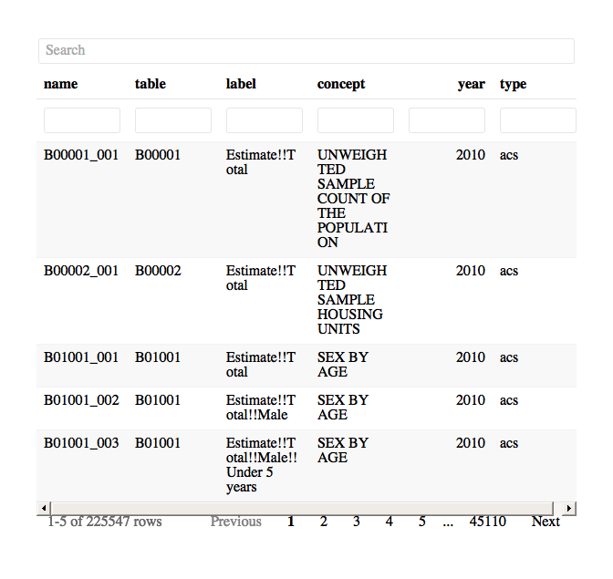

README
================

This package includes tools to make accessing census data faster. It
wraps commands from the excellent
[**tidycensus**](https://walkerke.github.io/tidycensus/index.html)
package, which pulls from the Census API. If you haven’t already, you’ll
need to install a census API key. [**Sign up for an API key
here**](https://api.census.gov/data/key_signup.html). Then [**follow
these
instructions**](https://walkerke.github.io/tidycensus/reference/census_api_key.html)
to install it in your .Renviron file for repeated use.

`JDJcensus` builds on `tidycensus` by providing a built-in dataframe
with all variable names from different data sources combined. It also
returns census data with the data source, year, and text label appended.

## Getting started

Install the package this way.

`devtools::install_github("jdjohn215/JDJcensus")`

`JDJcensus` includes a built in file showing all the available variables
from 2010-2018 American Community Surveys (ACS) and the 1990, 2000, 2010
SF1 decennial census products. You can access it by running
`View(AllVariables)`. It looks like this

<!-- -->

## Downloading data

You can identify the table you want to download either with “table” code
or the “concept” label. For example, the `SEX BY AGE` concept is table
code `B01001`.

Use either the table code or concept label in the `table_download`
function.

This example downloads the selected table for census tracts in Milwaukee
County, Wisconsin from the 2018 5YR ACS.

``` r
table_download("HISPANIC OR LATINO ORIGIN BY RACE",
               geography = "tract", source = "acs", year = 2018, 
               state = "WI", county = "MILWAUKEE")
#> Joining, by = c("variable", "year")
#> # A tibble: 6,258 x 7
#>    GEOID   NAME           variable estimate   moe  year label              
#>    <chr>   <chr>          <chr>       <dbl> <dbl> <dbl> <chr>              
#>  1 550790… Census Tract … B03002_…     4476   437  2018 Estimate!!Total    
#>  2 550790… Census Tract … B03002_…     4090   478  2018 Estimate!!Total!!N…
#>  3 550790… Census Tract … B03002_…     1047   308  2018 Estimate!!Total!!N…
#>  4 550790… Census Tract … B03002_…     2879   504  2018 Estimate!!Total!!N…
#>  5 550790… Census Tract … B03002_…        0     9  2018 Estimate!!Total!!N…
#>  6 550790… Census Tract … B03002_…       64    58  2018 Estimate!!Total!!N…
#>  7 550790… Census Tract … B03002_…        0     9  2018 Estimate!!Total!!N…
#>  8 550790… Census Tract … B03002_…        0     9  2018 Estimate!!Total!!N…
#>  9 550790… Census Tract … B03002_…      100    96  2018 Estimate!!Total!!N…
#> 10 550790… Census Tract … B03002_…       28    46  2018 Estimate!!Total!!N…
#> # … with 6,248 more rows
```

This example downloads the same table for each state in the 2010
decennial census.

``` r
table_download("HISPANIC OR LATINO ORIGIN BY RACE",
               geography = "state", source = "sf1", year = 2010)
#> Joining, by = c("variable", "year")
#> # A tibble: 884 x 6
#>    GEOID NAME        variable    value  year label
#>    <chr> <chr>       <chr>       <dbl> <dbl> <chr>
#>  1 01    Alabama     P005001   4779736  2010 Total
#>  2 02    Alaska      P005001    710231  2010 Total
#>  3 04    Arizona     P005001   6392017  2010 Total
#>  4 05    Arkansas    P005001   2915918  2010 Total
#>  5 06    California  P005001  37253956  2010 Total
#>  6 22    Louisiana   P005001   4533372  2010 Total
#>  7 21    Kentucky    P005001   4339367  2010 Total
#>  8 08    Colorado    P005001   5029196  2010 Total
#>  9 09    Connecticut P005001   3574097  2010 Total
#> 10 10    Delaware    P005001    897934  2010 Total
#> # … with 874 more rows
```

Commonly, I find myself downloading data for the same area over and over
again. Here’s an example of a simple helper function that can speed up
that process.

``` r
quick_acs <- function(table){
  table_download(table = table, geography = "tract", source = "acs", year = 2018,
                 state = "WI", county = "MILWAUKEE")
}

quick_acs("MEDIAN AGE BY SEX")
#> Joining, by = c("variable", "year")
#> # A tibble: 894 x 7
#>    GEOID   NAME                variable  estimate   moe  year label        
#>    <chr>   <chr>               <chr>        <dbl> <dbl> <dbl> <chr>        
#>  1 550790… Census Tract 1.01,… B01002_0…     30.7   3.6  2018 Estimate!!Me…
#>  2 550790… Census Tract 1.01,… B01002_0…     29.4   6.6  2018 Estimate!!Me…
#>  3 550790… Census Tract 1.01,… B01002_0…     32.8  11    2018 Estimate!!Me…
#>  4 550790… Census Tract 1.02,… B01002_0…     42.2   6.4  2018 Estimate!!Me…
#>  5 550790… Census Tract 1.02,… B01002_0…     32.6   3.7  2018 Estimate!!Me…
#>  6 550790… Census Tract 1.02,… B01002_0…     48     4.2  2018 Estimate!!Me…
#>  7 550790… Census Tract 2.01,… B01002_0…     25.3   3.3  2018 Estimate!!Me…
#>  8 550790… Census Tract 2.01,… B01002_0…     21.6   7.9  2018 Estimate!!Me…
#>  9 550790… Census Tract 2.01,… B01002_0…     31     7.3  2018 Estimate!!Me…
#> 10 550790… Census Tract 2.02,… B01002_0…     35.2   2.1  2018 Estimate!!Me…
#> # … with 884 more rows
```
